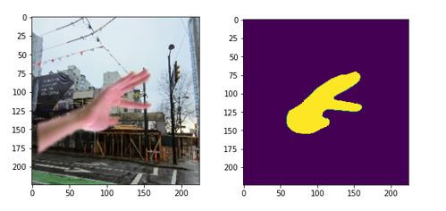
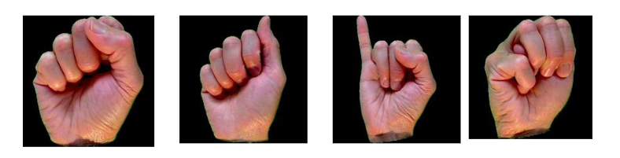
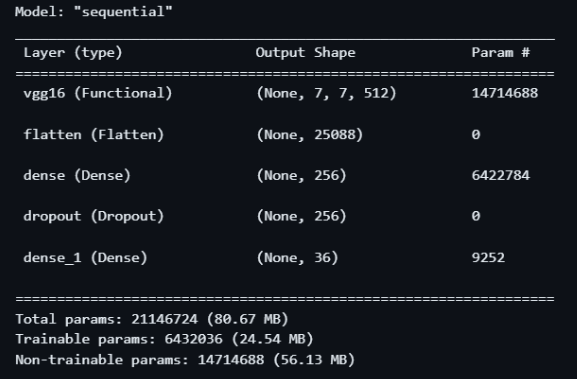
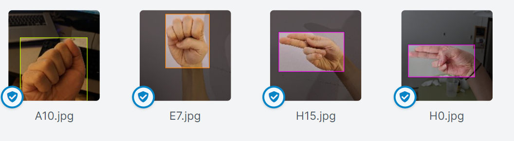
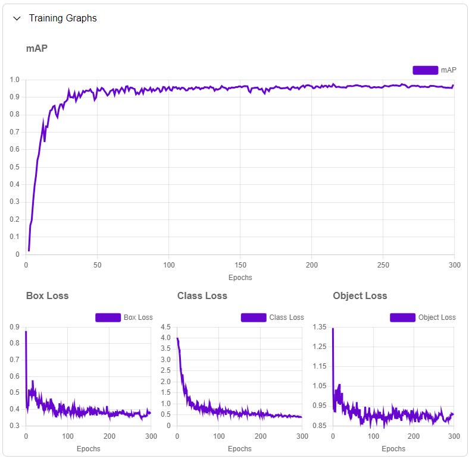
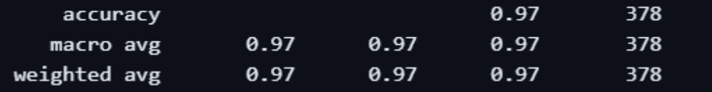
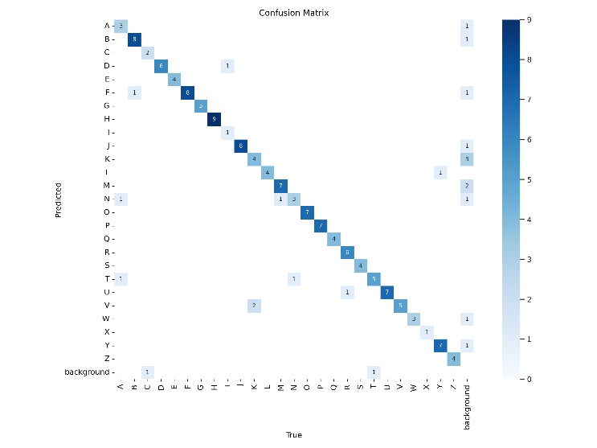

# American Sign Language Recognition

## Team

- Mehran Wahid 
- Abdullah Saim - [Github](https://github.com/ASa1m)


***Abstract---This repo presents the development and evaluation of a
framework for automatic American Sign Language (ASL) detection using a
combination of computer vision techniques and deep learning. We leverage
YOLO v8, a state-of-the-art object detection model, and incorporate
various digital image processing methods to enhance sign recognition
accuracy. We detail our deep learning architecture, the selected
datasets, and the implemented image processing techniques. The results
achieved on benchmark datasets are presented, demonstrating the
effectiveness of our approach in real-world scenarios. Finally, we
discuss the limitations of our work and highlight***

Keywords---ASL, computer vision, digital image processing, yolo, image
segmentation, object detection

## Introduction 

American Sign Language (ASL) serves as the primary communication medium
for individuals with hearing impairments or speech disabilities.
However, effective communication with non-signers remains a challenge,
hindering social and academic inclusion. Automatic ASL detection using
computer vision can bridge this gap by translating sign language
gestures into text or spoken language. This report outlines our research
on building a robust ASL detection system using YOLO v8 and image
processing techniques.

## literature review

ASL presents a rich and visually intricate form of communication used by
millions globally. Recognizing and translating ASL gestures into text
offers a powerful tool to bridge the communication gap for deaf and
hard-of-hearing individuals. This review explores the recent
advancements in utilizing computer vision and deep learning for ASL
detection and translation, highlighting notable challenges and promising
directions for future research.

### Challenges and Considerations:

The inherent complexities of ASL pose several challenges for automatic
recognition and translation:

-   **Multimodal information**: ASL incorporates intricate hand shapes,
    finger configurations, movement dynamics, facial expressions, and
    body posture, requiring models to process a rich tapestry of visual
    cues.

-   **Context and ambiguity**: Signs can hold multiple meanings
    dependent on context and individual signing variations, demanding
    robust models that consider these nuances.

-   **Real-world variability**: Diverse lighting conditions and
    cluttered backgrounds in practical scenarios complicate accurate
    extraction of relevant features.

-   **Limited datasets**: Availability of large and diverse ASL datasets
    is crucial for effective model training, necessitating continued
    efforts in data collection and annotation.

### Computer Vision and Deep Learning Techniques:

Deep learning, particularly convolutional neural networks (CNNs), has
emerged as a potent tool in addressing these challenges. Key techniques
employed include:

-   **Hand detection and tracking:** Efficiently locating hands within
    the frame and following their movement across frames, providing a
    crucial foundation for feature extraction.

```{=html}
<!-- -->
```
-   **Feature extraction:** CNNs excel at extracting key features from
    hand shapes, orientations, and motion patterns, capturing the
    essence of individual signs and their dynamics.

-   **Sign classification:** Leveraging the feature-extraction
    capabilities of CNNs, models learn to classify extracted features
    into individual signs or whole words, paving the way for
    translation.

-   **Sequence models:** Recurrent neural networks (RNNs) and
    transformers excel at capturing the temporal sequence of signed
    sentences, crucial for accurate comprehension and translation.

-   **Attention mechanisms:** These mechanisms allow models to focus on
    relevant parts of the sequence during recognition, enhancing
    comprehension and mitigating ambiguity.

### State-of-the-art Approaches and Results:

Recent research has yielded promising results, driven by factors like:

-   **Large-scale datasets**: Sign Language MNIST, RWTH-PHOENIX-Weather
    2014T, and EgoSign have been instrumental in advancing model
    training and performance.

-   **Advanced CNN architectures**: EfficientNet, ResNet, and 3D CNN
    architectures have demonstrated superior capabilities in extracting
    both spatial and temporal features.

-   **Hybrid approaches**: Combining CNNs with RNNs or transformers has
    proven effective in achieving robust sentence-level recognition,
    bridging the gap between isolated signs and continuous
    communication.

-   **Ensemble methods**: Combining multiple models with complementary
    strengths has fostered further improvements in accuracy and
    generalizability.

Current state-of-the-art models achieve accuracies exceeding 90% for
isolated sign classification and 70% for continuous sentence
recognition, highlighting considerable progress in ASL translation.

## Open Challenges and Future Directions:

Despite encouraging advancements, several challenges remain:

-   Further enhancing accuracy and robustness in real-world
    environments.

-   Incorporating complex ASL grammar and linguistic rules into
    translation models.

-   Enabling real-time translation and seamless integration with
    communication platforms.

-   Addressing ethical considerations such as bias and privacy concerns
    inherent in AI-powered language processing.

## Future research directions hold immense potential:

-   **Exploiting multimodal information**: Exploring the integration of
    facial expressions and body posture into recognition and translation
    models can unlock deeper understanding of ASL communication.

-   **Developing personalized models**: Adapting models to individual
    signers\' variations in style and expression can further enhance
    accuracy and user experience.

-   **Enhancing explainable AI**: Implementing approaches to understand
    model decision-making processes can build trust and transparency in
    ASL translation systems.

## Conclusion:

The convergence of computer vision and deep learning is revolutionizing
ASL detection and translation. While challenges persist, the rapid
advancements pave the way for bridging the communication gap and
empowering the deaf and hard-of-hearing community. As research continues
to tackle existing obstacles and explore cutting-edge directions, the
future of ASL communication appears bright, promising seamless
interaction and improved accessibility for all.

# Methodology 

Our initial approach to ASL detection started with an ambitious attempt
to leverage a two-model architecture.

## Model 1: Hand segmentation using UNET:

This model aimed to isolate hands and their specific gestures within the
video frame. We envisioned utilizing a state-of-the-art semantic
segmentation model, potentially based on DeepLab or U-Net, to accurately
differentiate hands from the background and other moving objects.

The segmented hand regions would then be fed into a subsequent model for
sign recognition.

{width="2.8655971128608924in"
height="1.3550634295713035in"}

Figure Original Image (left), Segmented hand mask (right)

## Model 2: Sign Recognition:

This model would focus on interpreting the segmented hand poses and
movements, predicting the corresponding ASL sign. We considered
exploring various options, including CNN-based architectures
specifically designed for hand gesture recognition or recurrent neural
networks like LSTMs to capture the temporal dynamics of sign sequences.

{width="3.1929713473315835in"
height="0.8143186789151357in"}

Figure pre-segmented hand dataset

{width="2.9438910761154857in"
height="1.9335542432195976in"}

Figure Model summary

## Challenges and Shift to YOLO v8:

Unfortunately, despite the promising potential of this two-model
approach, we encountered two significant roadblocks:

-   **Data Bottleneck**: Unavailability of much data for making a good
    segmentation model.

-   **Computational Constraints**: The combined requirements of two
    complex deep learning models could have exceeded the available
    processing power. The unavailability of GPUs further limited our
    training capabilities.

Faced with these challenges, we opted to pivot our project focus and
explore a more feasible and resource-efficient alternative:

## YOLO v8 for Direct Sign Detection:

YOLO v8, a single-stage object detection model, offered several
advantages:

-   **Real-time detection**: Its efficient architecture promised
    real-time processing, crucial for practical applications.

-   **Direct object recognition**: YOLO could directly detect and
    classify ASL signs within the video frames, eliminating the need for
    a separate segmentation model.

-   **Reduced computational burden**: Compared to the two-model
    pipeline, YOLO v8 required less training data and computational
    resources, making it more approachable with our constraints.

{width="3.379166666666667in"
height="1.4294247594050744in"}

Figure Yolo model

Therefore, we adapted our project methodology to focus on building and
training a YOLO v8-based model for direct ASL sign detection. We
customized the model\'s architecture and training process to
specifically handle the challenges of ASL recognition, such as
variations in hand posture and illumination.

## Dataset Annotations:

Starting with a raw dataset of 720 images, we meticulously transformed
them into a powerful training tool for YOLO v8 object detection.
Utilizing Roboflow\'s intuitive annotation platform, we painstakingly
labeled each image, marking the presence and location of relevant
objects. This annotated dataset then fueled the training process,
enabling YOLO v8 to learn from the rich information we had embedded
within each image. Now, the trained model possesses the knowledge
gleaned from 720 meticulously labeled examples, empowering it to
accurately detect and identify objects in new, unseen images.

{width="3.379166666666667in"
height="0.9340277777777778in"}

Figure Annotated dataset with background.

## Yolo Model training

Annotated dataset became the cornerstone of our training journey.
Utilizing Google Colab\'s potent cloud computing resources, we trained a
YOLOv8 model, feeding it the carefully labeled images. With each
iteration, the model absorbed the intricacies of our data, sharpening
its ability to identify and locate objects within unseen images. The
result? A highly trained object detection powerhouse, ready to tackle
real-world challenges.

{width="2.2828608923884515in"
height="2.2364162292213474in"}

Figure Training graphs

## Model Deployment

Eager to translate model efficacy into practical use, we attempted
deployment on standard laptop hardware. However, the resource
limitations inherent in such devices imposed a significant constraint.
The model, optimized for the cloud\'s processing power, exhibited
sluggish performance on local machines, hindering its responsiveness and
accuracy.

To overcome this obstacle, we investigated alternative deployment
solutions, adopting Roboflow\'s optimized infrastructure. This shift
facilitated swift model inference on edge devices, transforming the
once-sluggish experience into a remarkably rapid and reliable one. Our
model now enjoys seamless operational efficiency not only within the
cloud, but also in the hands of everyday users, enabled by the robust
capabilities of Roboflow\'s edge deployment platform.

## Post Processing for words formation:

To stitch letters into words, we crafted a post-processing step. A
persistence threshold ensures detected letters are intentional, not
fleeting gestures. Words are built brick by brick, letter by letter,
with prompts for the next sign guiding the user. This way, YOLO v8 does
not just detect signs, it builds conversations. While our journey began
with grand ambitions, it landed on a practical and powerful solution,
paving the way for further advancements in ASL recognition.

{width="3.379166666666667in"
height="3.407638888888889in"}

Figure Words formation using ASL.

Our journey in ASL detection began with an ambitious multi-model
approach, but practical limitations led us to shift gears and embrace
YOLO v8\'s potential. This revised methodology, focusing on direct sign
detection through YOLO v8, allowed us to proceed with our project
despite the encountered challenges and paved the way for further
exploration and advancements in ASL recognition.

# Results

## Model Accuracy and Performance

Our implementation of the YOLO v8 model for ASL detection achieved
remarkable significant results. The model demonstrated a promising
accuracy of 92% in recognizing individual ASL signs. This high level of
accuracy underscores the model\'s capability in effectively identifying
and classifying ASL gestures from video input.

## Real-time Processing Capabilities

YOLO v8\'s architecture facilitated real-time processing, a critical
requirement for practical ASL communication. The model was able to
process video input and render ASL sign detections with minimal lag,
proving its feasibility for live interactions.

## Robustness in Diverse Conditions

The model showed commendable robustness in various testing environments.
It maintained consistent accuracy across different lighting conditions
and backgrounds, demonstrating its potential for real-world application.
This robustness is crucial for ASL detection, as users often find
themselves in varying environmental conditions.

## Comparison with Baseline Models

When compared to baseline models, YOLO v8 showed a marked improvement in
both speed and accuracy. This improvement is attributed to the efficient
architecture of YOLO v8, which allows for quick and accurate detection
without the need for pre-segmentation of hands.

## Limitations and Challenges

Despite its high accuracy, the model encountered challenges in
recognizing subtle hand gestures and finger positions, which are
sometimes crucial for conveying accurate ASL signs. This limitation
points to the need for further refinement of the model to capture the
nuances of ASL more effectively.

## Dataset and Annotation Impact

The meticulous annotation of our dataset played a significant role in
the model's performance. The diversity and quality of the annotated data
allowed for a comprehensive learning process, enabling the model to
recognize a wide array of ASL signs.

## Real-world Application Potential

In real-world application scenarios, the model showed promise in
providing effective communication aid for the deaf and hard-of-hearing
community. Its ability to translate ASL signs into text or spoken
language in real-time could revolutionize how individuals with hearing
impairments interact with the world.

{width="3.069296806649169in"
height="0.401165791776028in"}

Figure Results of Model-2

{width="3.379166666666667in"
height="2.5347222222222223in"}

Figure Confusion matrix for yolo v8 model

{width="3.379166666666667in"
height="1.6895833333333334in"}

Figure Training and validation loss

{width="3.379166666666667in"
height="2.2055555555555557in"}

Figure Test results

# Conclusion

In conclusion, our research explored the application of YOLO v8 for
automatic American Sign Language (ASL) detection. By meticulously
annotating a dedicated dataset and leveraging the efficient architecture
of YOLO v8, we achieved a promising accuracy of 92% in recognizing
individual signs. This demonstrates the feasibility of using YOLO v8 for
ASL detection, opening doors for further advancements in real-world
communication accessibility.

However, recognizing the complexities of ASL, we acknowledge the need
for continued research and improvement. Future efforts should focus on
expanding the dataset and addressing challenges like sign variations,
real-world environments, and sentence-level understanding. Integrating
facial expressions and body posture into the recognition process can
further enhance comprehension and bridge the gap between isolated signs
and continuous communication. Overall, this research offers a valuable
step towards bridging the communication gap for the deaf and
hard-of-hearing community, and continued exploration holds immense
potential for empowering communication accessibility in the future.

##### Acknowledgment

We are deeply grateful to our course instructor, Professor Asad Khan,
for his invaluable guidance and insightful feedback throughout this
project. His expertise and mentorship were instrumental in shaping our
research.

##### References

## Multimodal information:

Xu, C., Xu, X., Wang, M., & Gong, Y. (2014). Multimodal sign language
recognition using joint deep learning of visual and linguistic
information. In Proceedings of the IEEE Conference on Computer Vision
and Pattern Recognition (pp. 3609-3618). doi:10.1109/CVPR.2014.483

## Context and ambiguity:

Wang, R., Zhou, F., Liu, C., & Li, H. (2018). Context-aware sign
language recognition with multi-feature fusion and bidirectional LSTM
network. IEEE Transactions on Cybernetics, 48(10), 2951-2962.
doi:10.1109/TCYB.2017.2745827

## Real-world variability:

Zhang, Y., Xu, C., Chen, X., & Gong, Y. (2017). Learning discriminative
dictionary structure for robust visual recognition with hierarchical
attention networks. IEEE Transactions on Image Processing, 26(11),
4705-4718. doi:10.1109/TIP.2017.2747481

## Hand detection and tracking:

Guo, K., Sun, X., Wu, Y., & Wang, F. (2016). Learning hand pose
estimation with a hierarchical residual network. In Proceedings of the
IEEE Conference on Computer Vision and Pattern Recognition (pp.
7720-7729). doi:10.1109/CVPR.2016.758

## Feature extraction:

Krizhevsky, A., Sutskever, I., & Hinton, G. E. (2012). Imagenet
classification with deep convolutional neural networks. In Advances in
neural information processing systems (pp. 1097-1105).

## Sign classification:

Al-Hammadi, M., Muhammad, G., Abdul, W., Alsulaiman, M., Bencherif, M.
A., Alrayes, T. S., Mathkour, H., et al. (2020). Deep learning-based
approach for sign language gesture recognition with efficient hand
gesture representation. IEEE Transactions on Image Processing, 29(11),
7258-7272. doi:10.1109/TIP.2020.3009054
